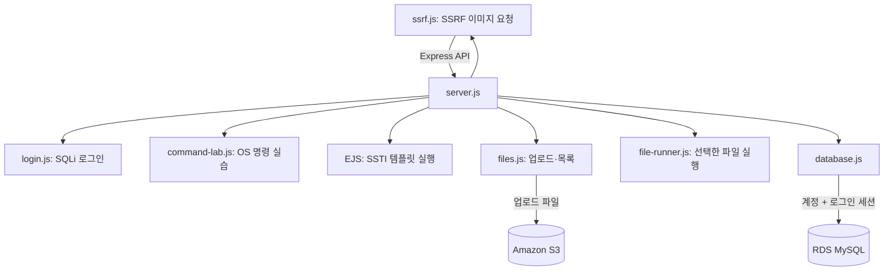
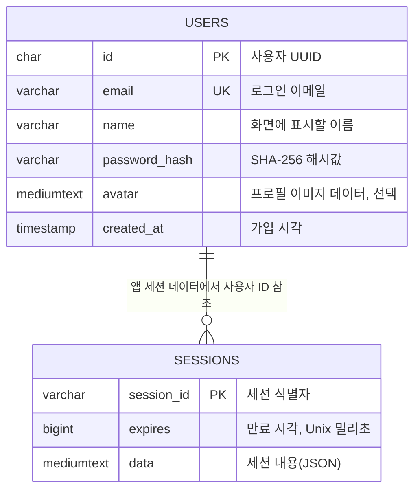

# WHS-Cloud9-Vuln-Web

**WHS-Cloud9-Vuln-Web**은 Node.js와 Express로 만든 클라우드 보안 실습 웹앱입니다. 로그인하면 파일 업로드, OS 명령, SSTI, 팀 프로필 이미지 실습을 할 수 있습니다. 첫 화면의 큰 버튼이나 상단 네비게이션에서 기능을 고르면 현재 화면 위에 모달(팝업 창)이 열립니다.

SQL Injection, OS 명령 실행, SSTI, SSRF, 업로드 파일 실행은 이 앱에 의도적으로 넣은 취약점입니다. 실제 개인정보나 운영 AWS 계정을 사용하지 마세요. 실습 전용 VPC·EC2·RDS·S3와 가짜 계정으로 진행하세요.

README는 파일 구조부터 보여준 뒤 로컬 실행, AWS 설정, 기능별 사용법 순으로 설명합니다. 배포 전에 구조와 설정을 먼저 확인하세요.

## 파일 전체 구조

### 프로젝트 파일 목록

```text
WHS-Cloud9-Vuln-Web/
├── README.md
├── .env.example
├── .env                    # .env.example을 복사해 생성하며 Git에는 포함하지 않음
├── .gitignore
├── package.json
├── package-lock.json
├── server.js
├── secrets.js
├── database.js
├── schema.sql
├── login.js
├── ssrf.js
├── image.js
├── command-lab.js
├── files.js
├── file-runner.js
├── public/
│   ├── index.html
│   ├── app.js
│   ├── style.css
│   └── whitehat-school-logo.png
└── node_modules/         # npm ci 실행 시 생성되며 Git에는 포함되지 않음
```

`node_modules/`는 `npm ci`를 실행할 때 필요한 라이브러리가 들어가는 폴더입니다. 앱은 데이터를 보관하려고 `data/` 폴더를 만들지 않습니다. 업로드한 스크립트를 실행할 때만 OS 임시 폴더에 잠시 복사하고, 실행이 끝나면 파일을 지웁니다.

### 앱과 저장소의 연결



### 주요 파일의 역할

| 파일 | 역할 |
| --- | --- |
| `server.js` | Express 앱 시작, 로그인, 세션, API 경로 연결 |
| `package.json`, `package-lock.json` | 앱 실행 명령과 설치할 라이브러리 목록·버전 기록 |
| `.env.example` | 로컬 설정을 시작할 때 복사하는 환경변수 예시 |
| `.gitignore` | `.env`와 `node_modules/`가 Git에 올라가지 않게 제외 |
| `public/index.html` | 로그인 화면, 인덱스, 네비게이션과 모달의 HTML |
| `public/app.js` | 브라우저 동작: 로그인 요청, 버튼·모달, 파일 업로드와 API 호출 |
| `public/style.css` | 화면 디자인과 모바일 크기 조정 |
| `database.js` | RDS MySQL 연결 |
| `schema.sql` | RDS에 `users`, `sessions` 테이블을 생성하는 SQL |
| `login.js` | SQL Injection 로그인 실습 |
| `ssrf.js` | SSRF 이미지 요청 실습 |
| `image.js` | 외부에서 가져온 이미지 형식을 확인 |
| `secrets.js` | 설정된 경우 Secrets Manager에서 비밀값을 읽음 |
| `command-lab.js` | OS 명령 실행 실습 |
| `files.js` | 파일 업로드, 사용자별 목록 조회, S3 저장 |
| `file-runner.js` | 저장된 스크립트를 서버에서 실행하고 결과 반환 |
| `.env` | DB, S3, 포트와 세션 키 등 실행 설정. 직접 만들며 Git에 올리지 않음 |

계정과 로그인 세션은 RDS의 `users`, `sessions` 테이블에, 업로드 파일은 S3에 저장합니다. EC2 인스턴스가 여러 대여도 같은 RDS와 S3를 연결하면 로그인 정보와 파일 목록을 함께 쓸 수 있습니다. 서버 로컬 디스크에 데이터를 남기지 않아 인스턴스가 바뀌어도 같은 정보를 읽는 구조를 stateless라고 합니다.

### 데이터베이스 구조

`schema.sql`은 `whs_cloud9` 데이터베이스와 아래 두 테이블을 만듭니다. `users`에는 가입 정보를, `sessions`에는 로그인 상태를 저장해 여러 EC2가 함께 읽습니다.



| 테이블 | 컬럼 | 용도 |
| --- | --- | --- |
| `users` | `id` | 사용자 UUID(중복되지 않는 계정 식별값). 파일 목록을 S3에서 사용자별로 구분할 때도 사용합니다. |
| `users` | `email` | 로그인 이메일. 중복 가입을 막기 위해 `UNIQUE`(중복 불가) 제약이 있습니다. |
| `users` | `name` | 화면에 표시하는 사용자 이름 |
| `users` | `password_hash` | 입력한 비밀번호 자체가 아니라 SHA-256으로 계산한 해시값입니다. 현재 실습용 로그인 코드는 SQL Injection에 취약합니다. |
| `users` | `avatar` | 선택한 프로필 이미지 데이터. 이미지를 URL로 미리보기 한 뒤 저장합니다. |
| `users` | `created_at` | 계정이 생성된 시각. 기본값은 DB의 현재 시각입니다. |
| `sessions` | `session_id` | 브라우저 로그인 세션의 식별값 |
| `sessions` | `expires` | 세션 만료 시각(Unix 시간 밀리초). 이 값에 인덱스가 있어 만료 세션을 찾기 쉽습니다. |
| `sessions` | `data` | Express가 만든 세션 정보를 JSON 문자열로 저장합니다. 로그인한 사용자 ID도 이 데이터에 들어갑니다. |

`users.id`와 `sessions` 사이에는 DB 외래 키가 없습니다. 앱은 세션의 `data`에 담긴 사용자 ID로 `users`에서 계정을 찾습니다. 비밀번호는 세션 행에 들어가지 않고, 해시값만 `users.password_hash`에 저장됩니다. 업로드 파일 내용은 MySQL에 넣지 않고 S3에 보관합니다.

## 로컬에서 실행하기

로컬에서 실행해도 데이터는 RDS MySQL과 S3에 저장됩니다. 로컬 PC에서 두 서비스에 연결할 네트워크와 AWS 자격 증명을 준비하세요. Secrets Manager를 쓴다면 그 서비스에도 접근할 수 있어야 합니다. Node.js **22.13 이상**이 필요하며, Windows에서는 OS 명령 실습을 지원하지 않습니다.

1. 프로젝트 폴더에서 `.env.example`을 복사해 `.env`를 만듭니다.
2. RDS endpoint, DB 이름, 앱 계정, RDS 인증서 파일 경로, S3 버킷과 리전을 설정합니다. Secrets Manager를 쓰면 `SECRETS_MANAGER_SECRET_ID`를 설정하고, 로컬 AWS 자격 증명도 준비합니다.
3. 터미널에서 다음 명령을 실행합니다.

```sh
npm ci
npm start
```

브라우저에서 http://127.0.0.1:3000 을 열어 회원가입하면 됩니다. RDS 연결 정보나 S3 버킷 이름이 없으면 앱이 시작되지 않습니다. 연결에 문제가 생기면 회원가입 요청이나 파일 업로드처럼 해당 서비스를 쓰는 기능으로 확인하세요.

## AWS 배포 설정

### EC2 런타임 준비

`package.json`에 지정된 Node.js 버전은 **22.13 이상**입니다. EC2에서 `node -v` 결과가 `v18.x`이면 `npm ci`가 `EBADENGINE` 경고와 함께 끝날 수 있어도, 앱이 정상 동작한다는 보장은 없습니다. Amazon Linux 2023에서는 저장소에 있는 Node.js 22 패키지를 설치할 수 있습니다.

```sh
sudo dnf install nodejs22 nodejs22-npm
node -v
npm -v
```

`node -v`가 `v22.13.0` 이상으로 나오는지 확인한 뒤 `npm ci`를 실행합니다. 이 명령은 `package-lock.json`에 기록된 버전대로 라이브러리를 설치합니다.

`.env`에서:

```dotenv
HOST=0.0.0.0
PORT=3000
SECRETS_MANAGER_SECRET_ID=whs-cloud9-vuln-web/prod

DB_PORT=3306
DB_SSL_CA=/opt/whs-cloud9/certs/global-bundle.pem

AWS_REGION=ap-northeast-2
S3_BUCKET=whs-cloud9-vuln-web-lab-896986966760-ap-northeast-2-an
S3_PREFIX=whs-uploads/
```

이 앱은 RDS MySQL과 S3를 필수로 사용합니다. RDS 설정이 빠지면 앱이 시작되지 않고, S3 버킷이나 권한에 문제가 있으면 파일 기능이 실패합니다. 서버 디스크에 영구 저장하는 대체 경로는 없습니다.

### 환경변수 뜻

| 변수 | 의미 | 예시 |
| --- | --- | --- |
| `HOST` | 앱이 요청을 받을 네트워크 주소. EC2에서 외부 ALB/VPN을 통해 들어오는 연결도 받도록 할 때 `0.0.0.0` 사용 | `0.0.0.0` |
| `PORT` | Express 앱의 포트 | `3000` |
| `SECRETS_MANAGER_SECRET_ID` | EC2에서 읽을 Secrets Manager 비밀 이름 또는 ARN. 설정하면 DB 접속값과 세션 키를 이곳에서 읽음 | `whs-cloud9-vuln-web/prod` |
| `SESSION_SECRET` | 로컬 실행 때 쓰는 로그인 쿠키 서명 키. EC2는 Secrets Manager에 저장 | 무작위 문자열 |
| `DB_HOST`, `DB_PORT` | RDS 접속 주소와 포트 | RDS endpoint, `3306` |
| `DB_NAME` | 사용할 DB 이름 | `whs_cloud9` |
| `DB_USER`, `DB_PASSWORD` | 로컬 실행 때 쓰는 앱 전용 MySQL 계정 값. EC2에서는 Secrets Manager에 저장 | `whs_app`, 앱 계정 비밀번호 |
| `DB_SSL_CA` | RDS 서버 인증서 묶음 파일의 EC2 내 경로 | `/opt/whs-cloud9/certs/global-bundle.pem` |
| `AWS_REGION`, `S3_BUCKET` | 사용할 S3 리전과 버킷 | `ap-northeast-2`, 버킷 이름 |
| `S3_PREFIX` | 버킷 안의 앱 파일 경로 | `whs-uploads/` |

`.env.example`을 복사해 `.env`를 만들고 실제 값만 채웁니다. `.env`는 비밀번호와 세션 키가 있어 외부에 공유하거나 Git에 올리면 안 됩니다.

### RDS MySQL 설정

계정과 로그인 세션은 RDS MySQL에 저장합니다. RDS는 EC2와 같은 리전에 만들고 인터넷에서 직접 접속할 수 없게 설정하세요. 콘솔 메뉴는 바뀔 수 있으니 [RDS DB 인스턴스 생성 공식 안내](https://docs.aws.amazon.com/AmazonRDS/latest/UserGuide/USER_CreateDBInstance.html)도 참고하면 좋습니다.

#### 1. RDS 만들기

1. AWS 콘솔에서 **RDS → Databases → Create database**를 엽니다.
2. 엔진은 **MySQL**을 고릅니다. EC2와 같은 리전(현재 설정 예시는 서울 `ap-northeast-2`)을 선택합니다.
3. 실습용이면 템플릿은 **Dev/Test**를 고르고, DB 식별자는 예를 들어 `whs-cloud9-mysql`로 정합니다.
4. 마스터 사용자 이름과 비밀번호를 만듭니다. 마스터 비밀번호는 앱 `.env`에 넣지 않습니다.
5. **Connectivity**에서 EC2와 같은 VPC의 private DB subnet group을 선택합니다. 목록에 적절한 그룹이 없다면 RDS의 **Subnet groups → Create DB subnet group**에서 같은 VPC의 private subnet을 서로 다른 가용 영역(AZ) 두 곳 이상 골라 만듭니다. **Public access**는 `No`로 둡니다.
6. RDS 보안 그룹의 인바운드 규칙에는 MySQL/Aurora TCP `3306`, 소스에는 웹앱 EC2의 **보안 그룹 ID**를 지정합니다. EC2 보안 그룹의 아웃바운드가 제한되어 있다면 EC2에서 RDS 보안 그룹으로 나가는 TCP `3306`도 허용합니다. `0.0.0.0/0`은 사용하지 마세요. 보안 그룹은 방화벽 규칙입니다.
7. 백업 보존 기간, 스토리지, 모니터링을 실습 비용과 복구 필요에 맞춰 선택하고 DB를 만듭니다. DB를 켜 둔 시간뿐 아니라 저장 공간과 백업에도 비용이 붙을 수 있습니다.
8. 상태가 `Available`이 되면 DB 상세의 **Connectivity & security**에서 endpoint(접속 주소)와 port를 확인합니다. MySQL 기본 포트는 `3306`입니다. [엔드포인트 확인 안내](https://docs.aws.amazon.com/AmazonRDS/latest/UserGuide/CHAP_CommonTasks.Connect.EndpointAndPort.html)

#### 2. DB와 테이블 만들기

RDS에 접속할 관리 PC나 EC2에 MySQL 클라이언트를 준비합니다. RDS가 private subnet에 있으면 인터넷에 연결된 개인 PC에서 바로 접속할 수 없으니, 같은 VPC의 EC2나 승인된 관리 경로를 이용하세요. RDS CA 인증서 묶음은 [AWS 공식 안내](https://docs.aws.amazon.com/AmazonRDS/latest/UserGuide/UsingWithRDS.SSL.html)에서 받을 수 있습니다.

EC2에서 `mysql --version`으로 MySQL 명령줄 클라이언트가 있는지 확인합니다. 없으면 EC2 운영체제의 공식 패키지 저장소에서 MySQL 클라이언트를 설치합니다. RDS CA 인증서 파일은 아래의 공식 다운로드 주소에서 받아 문서의 경로에 둡니다. EC2에 인터넷 경로가 없다면 인터넷이 되는 관리 PC에서 받은 파일을 승인된 배포 경로로 EC2에 복사합니다.

```sh
sudo mkdir -p /opt/whs-cloud9/certs
sudo curl -o /opt/whs-cloud9/certs/global-bundle.pem https://truststore.pki.rds.amazonaws.com/global/global-bundle.pem
ls -l /opt/whs-cloud9/certs/global-bundle.pem
```

이 파일은 RDS 서버 인증서를 확인할 때 쓰는 공개 CA 인증서 묶음입니다. DB 비밀번호처럼 감출 값은 아니므로 Secrets Manager에 저장할 필요가 없습니다. `.env`의 `DB_SSL_CA`에는 이 파일의 절대 경로를 적습니다.

Amazon Linux 2023의 `mariadb105` 패키지를 설치하면 `mysql` 명령을 쓸 수 있습니다. 이는 MariaDB 클라이언트라 Oracle MySQL 클라이언트와 TLS 옵션이 다를 수 있습니다. 설치한 뒤 `mysql --version`으로 종류와 버전을 확인하세요.

```sh
sudo dnf install mariadb105
mysql --version
```

접속 명령에는 `-p`만 적어 비밀번호를 프롬프트에서 입력하세요. `-pPASSWORD`처럼 명령에 직접 쓰거나 명령 치환으로 불러오면 프로세스 정보나 터미널 기록에 남을 수 있습니다. 아래 명령의 `RDS_ENDPOINT`와 `MASTER_USER`를 실제 값으로 바꾸면 비밀번호 입력을 요청합니다.

```sh
mysql -h RDS_ENDPOINT -P 3306 -u MASTER_USER \
  --ssl-ca=/opt/whs-cloud9/certs/global-bundle.pem \
  --ssl-verify-server-cert -p
```

접속하면 `mysql>` 프롬프트가 나타납니다. 여기서 EC2에 복사한 스키마 파일을 실행합니다.

```sql
SOURCE /opt/WHS-Vuln-Web/schema.sql;
USE whs_cloud9;
SHOW TABLES;
```

`schema.sql`은 `whs_cloud9` 데이터베이스와 `users`(계정·프로필), `sessions`(로그인 상태) 테이블을 만듭니다. 앱이 대신 만들어 주지는 않습니다. 새로 접속하면 아직 DB를 선택하지 않아 `MySQL [(none)]>`로 표시될 수 있습니다. `USE whs_cloud9;`를 실행한 다음 `SHOW TABLES;`를 입력하세요.

#### 3. 앱 전용 DB 계정 만들기

마스터 계정은 초기 DB 설정에만 씁니다. 웹앱은 권한을 줄인 전용 계정 `whs_app`으로 접속하세요. 마스터 계정으로 다음 SQL을 실행해 계정을 만들고, `openssl rand -hex 32` 같은 명령으로 비밀번호를 생성해 앱용 Secrets Manager 비밀에 저장합니다.

```sql
CREATE USER 'whs_app'@'%' IDENTIFIED BY '여기에-긴-임의-비밀번호';
GRANT SELECT, INSERT, UPDATE ON whs_cloud9.users TO 'whs_app'@'%';
GRANT SELECT, INSERT, UPDATE, DELETE ON whs_cloud9.sessions TO 'whs_app'@'%';
```

`%`는 MySQL 계정에서 접속 호스트를 뜻합니다. 실제 네트워크 연결 범위는 RDS 보안 그룹에서 EC2로 제한합니다. 앱 계정에는 데이터베이스나 테이블을 만드는 권한을 주지 마세요.

#### 4. EC2에서 앱 설정

Secrets Manager를 사용하지 않고 로컬에서 실행하거나 환경변수를 직접 설정한다면 `.env`에 RDS endpoint, DB 이름과 앱 계정을 설정합니다. AWS 배포에서는 아래 Secrets Manager 연결 절차에 따라 민감한 값을 저장합니다. `DB_SSL_CA`는 인증서 파일의 실제 경로여야 합니다.

```dotenv
DB_HOST=RDS_ENDPOINT
DB_PORT=3306
DB_NAME=whs_cloud9
DB_USER=whs_app
DB_SSL_CA=/opt/whs-cloud9/certs/global-bundle.pem
```

수동 설정 시 `SESSION_SECRET`도 `.env`에 설정합니다. AWS 배포에서는 이 값도 Secrets Manager JSON에 보관합니다. 무작위 값을 만들 때는 다음 명령을 쓰세요.

```sh
node -e "console.log(require('crypto').randomBytes(32).toString('hex'))"
```

EC2를 여러 대 띄운다면 모두 같은 Secrets Manager 비밀을 읽어야 로그인 쿠키를 확인할 수 있습니다. `npm start`로 실행한 앱은 사용자 정보와 세션을 RDS에 저장합니다.

#### 5. 연결 확인

1. 앱이 실행되고 브라우저의 `/api/health`에서 `database: "mysql"`을 확인합니다. 이는 모드 확인이며 DB 연결 자체를 보증하지는 않습니다.
2. 회원가입과 로그인을 해보고, RDS의 `users` 테이블에 계정이 생겼는지 확인합니다.
3. `sessions` 테이블에 세션 행이 생기는지 확인합니다.
4. 로그인 상태에서 앱을 재시작한 뒤 페이지를 새로고침합니다. 로그인 상태가 유지되면 세션이 RDS에 저장된 것입니다.
5. 여러 EC2로 확장한 경우 각 인스턴스가 같은 RDS와 Secrets Manager 비밀을 사용해야 합니다. 로드 밸런서(ALB)에서 요청이 다른 인스턴스로 가도 로그인 상태가 유지되는지 확인합니다.

로그아웃했거나 만료된 세션은 더 이상 사용할 수 없습니다. 다만 해당 행은 DB에 남을 수 있으니, 필요할 때 관리자가 다음 SQL로 정리합니다.

```sql
DELETE FROM whs_cloud9.sessions WHERE expires <= UNIX_TIMESTAMP(CURRENT_TIMESTAMP(3)) * 1000;
```

앱은 [TLS로 연결을 암호화하고 RDS 인증서를 확인](https://docs.aws.amazon.com/AmazonRDS/latest/UserGuide/mysql-ssl-connections.html)합니다. 연결되지 않으면 endpoint와 비밀번호부터 확인하고, EC2·RDS의 VPC와 보안 그룹, CA 파일 경로를 이어서 살펴보세요.

#### RDS 요금 확인

RDS 생성 화면의 예상 요금에는 리전, 실행 시간, Single-AZ/Multi-AZ, 스토리지, 백업과 추가 기능이 반영됩니다. `db.t3.micro`만 선택해서는 전체 금액을 알 수 없습니다. 테스트용 단일 DB라면 `Single-AZ`를 확인하고 RDS Proxy는 건너뛰어도 됩니다. Proxy는 앱과 DB 사이에서 연결을 재사용하는 서비스로, 연결이 자주 만들어지는 앱에 도움이 되지만 별도 요금이 듭니다. 예상액이 높게 나오면 Billing 화면에서 어떤 항목이 비용을 더하는지 확인하세요. 무료 사용 한도는 계정 생성 시점과 요금제에 따라 다릅니다. DB를 중지해도 스토리지와 백업 비용은 계속 청구될 수 있습니다. [RDS MySQL 요금](https://aws.amazon.com/rds/mysql/pricing/) · [RDS 무료 사용 조건](https://aws.amazon.com/rds/free/)

RDS 연결은 `database.js`, 취약한 로그인 쿼리는 `login.js`에서 처리합니다. MySQL 연결은 TLS(암호화 연결) 인증서를 검증합니다. 비밀번호는 실습 편의를 위해 SHA-256 해시로 저장하며, 운영 서비스에서 쓸 방식은 아닙니다. 이전 버전의 scrypt 계정은 여기서 호환되지 않으니 별도 실습 DB나 계정을 사용하세요.

### AWS Secrets Manager 연결

EC2에서는 RDS 비밀번호와 `SESSION_SECRET`을 `.env`에 넣지 않습니다. 앱이 시작할 때 Secrets Manager에서 읽습니다. 읽기에 실패하면 임의의 기본값으로 실행하지 않고 시작을 중단합니다. AWS SDK는 EC2 인스턴스 프로파일(IAM 역할)이 발급한 임시 자격 증명을 자동으로 사용하므로 액세스 키를 코드나 `.env`에 적지 마세요. [AWS SDK for JavaScript v3 공식 예제](https://docs.aws.amazon.com/sdk-for-javascript/v3/developer-guide/javascript_secrets-manager_code_examples.html)

#### 1. 비밀값 만들기

AWS 콘솔에서 **Secrets Manager → Store a new secret → Other type of secret**을 선택합니다. 아래 JSON을 키 이름까지 그대로 저장하고, 예를 들어 비밀 이름을 `whs-cloud9-vuln-web/prod`로 지정합니다.

```json
{
  "SESSION_SECRET": "길고-무작위인-세션-서명-값",
  "DB_HOST": "RDS의 실제 엔드포인트",
  "DB_NAME": "whs_cloud9",
  "DB_USER": "whs_app",
  "DB_PASSWORD": "앱-DB-비밀번호"
}
```

`DB_PORT`, `DB_SSL_CA`, S3 버킷 이름과 리전은 비밀이 아니므로 EC2의 `.env`에 둡니다. RDS CA 인증서 파일도 EC2에 별도로 복사해야 합니다.

#### 2. EC2가 비밀값을 읽도록 설정

EC2에 연결한 **인스턴스 프로파일의 IAM 역할**에 `secretsmanager:GetSecretValue`를 추가하고, 접근 범위는 앱 비밀 하나로 제한합니다. `rds!db-...`로 시작하는 비밀은 RDS 마스터 계정용입니다. 앱에는 마스터 비밀 권한을 주지 말고, `whs_app` 계정 정보를 담은 `VulnWeb-DB-env` 비밀만 읽게 설정하세요. EC2에는 인스턴스 프로파일 역할 하나를 연결할 수 있으므로, 그 역할에 앱 비밀과 S3에 필요한 최소 권한을 함께 둡니다.

정책 예시의 `<APP_SECRET_ARN>`에는 Secrets Manager 화면에 보이는 앱 비밀의 전체 ARN을 넣습니다. `Resource: "*"`로 모든 비밀을 허용하지 마세요.

```json
{
  "Version": "2012-10-17",
  "Statement": [
    {
      "Sid": "ReadOnlyAppSecret",
      "Effect": "Allow",
      "Action": "secretsmanager:GetSecretValue",
      "Resource": "<APP_SECRET_ARN>"
    }
  ]
}
```

시크릿을 기본 `aws/secretsmanager` KMS 키가 아닌 고객 관리형 KMS 키로 암호화했다면 해당 키의 `kms:Decrypt` 권한도 필요합니다. [Secrets Manager IAM 권한 안내](https://docs.aws.amazon.com/secretsmanager/latest/userguide/auth-and-access_iam-policies.html)

EC2가 private subnet에 있고 NAT 경로도 없다면 VPC에 Secrets Manager 인터페이스 엔드포인트(`com.amazonaws.ap-northeast-2.secretsmanager`)를 둡니다. 엔드포인트 보안 그룹은 EC2 보안 그룹에서 오는 HTTPS(443)를 허용해야 합니다. IAM 권한이 있어도 네트워크 경로가 없으면 앱은 비밀을 가져오지 못합니다.

#### 3. EC2 환경 설정 및 실행

EC2의 `.env`에는 다음처럼 연결 모드와 비밀 이름만 적고, `DB_PASSWORD`나 `SESSION_SECRET`은 적지 않습니다.

```dotenv
HOST=0.0.0.0
PORT=3000
SECRETS_MANAGER_SECRET_ID=whs-cloud9-vuln-web/prod
DB_PORT=3306
DB_SSL_CA=/opt/whs-cloud9/certs/global-bundle.pem
AWS_REGION=ap-northeast-2
S3_BUCKET=여기에-S3-버킷-이름
S3_PREFIX=whs-uploads/
```

필요한 IAM 권한을 EC2 역할에 추가한 뒤 `npm ci`와 `npm start`를 실행합니다. 앱은 시작할 때 `.env`의 `SECRETS_MANAGER_SECRET_ID`를 사용해 JSON을 한 번 읽고, `SESSION_SECRET`, `DB_HOST`, `DB_NAME`, `DB_USER`, `DB_PASSWORD`를 설정합니다. 이 다섯 값은 `.env`에서 지우고 Secrets Manager에만 보관하세요. `SECRETS_MANAGER_SECRET_ID`는 시크릿의 이름 또는 ARN이며, `SESSION_SECRET` 값이 아닙니다. `.env`에 `SESSION_SECRET`이 있어도 Secrets Manager 로딩이 성공하면 JSON의 값으로 덮어씁니다. 값을 바꾼 뒤에는 새 설정을 읽도록 앱을 재시작하세요. [Secrets Manager 암호화 안내](https://docs.aws.amazon.com/secretsmanager/latest/userguide/security-encryption.html)

### S3 업로드

업로드·목록·파일 읽기 코드는 `files.js`, 실행 코드는 `file-runner.js`입니다. 업로드 파일은 항상 S3에 저장합니다. EC2에서는 인스턴스 IAM 역할을 사용하고 AWS 키를 코드에 넣지 않습니다. 로컬 개발에서는 AWS 자격 증명으로 S3 접근 권한을 준비해야 합니다.

현재 코드가 필요한 S3 동작은 `PutObject`(업로드), `ListObjectsV2`(사용자 파일 목록), `GetObject`(실행할 파일 읽기)입니다. 이에 맞춘 권한 예시는 다음과 같습니다. `ListBucket`은 버킷 ARN에, 객체 동작은 `whs-uploads/` 객체 ARN에 적용합니다. 삭제 기능이 없으므로 `DeleteObject`는 넣지 않습니다.

```json
{
  "Version": "2012-10-17",
  "Statement": [
    {
      "Sid": "ListWHSUploads",
      "Effect": "Allow",
      "Action": "s3:ListBucket",
      "Resource": "arn:aws:s3:::whs-cloud9-vuln-web-lab-896986966760-ap-northeast-2-an",
      "Condition": {
        "StringLike": {
          "s3:prefix": "whs-uploads/*"
        }
      }
    },
    {
      "Sid": "ReadWriteWHSUploadObjects",
      "Effect": "Allow",
      "Action": ["s3:PutObject", "s3:GetObject"],
      "Resource": "arn:aws:s3:::whs-cloud9-vuln-web-lab-896986966760-ap-northeast-2-an/whs-uploads/*"
    }
  ]
}
```

이 S3 문장과 위 앱 시크릿 문장을 EC2 앱 역할 정책에 함께 추가할 수 있습니다. 시크릿 읽기 권한과 S3 권한은 **IAM 역할 설정**이며, 보안 그룹 인바운드 규칙으로 부여하는 권한이 아닙니다. 고객 관리형 KMS 키로 객체를 암호화했다면 키 권한도 별도로 확인하세요.

S3에는 실제 폴더가 없습니다. 객체 이름 앞에 경로를 붙여 콘솔에서 폴더처럼 보이게 합니다. 앱은 `whs-uploads/<사용자 UUID>/<무작위 UUID>--<인코딩된 원본 파일명>` 형식으로 파일을 저장합니다. 예를 들면 `whs-uploads/7c7087fe-378a-469a-a2bb-de95e08349b3/3e...--hello.js`입니다. 미리 폴더나 객체를 만들 필요는 없습니다. 사용자 UUID가 경로에 들어가 각자 파일 목록을 나눕니다.

버킷의 퍼블릭 액세스 차단은 켜 두세요. 서버가 S3로 직접 업로드하므로 CORS 설정은 필요하지 않습니다. 버킷에서 고객 관리형 KMS 키를 쓴다면 앱 역할에 해당 키 권한도 추가해야 합니다. 업로드는 파일을 저장할 뿐 실행하지 않습니다. 사용자가 목록의 실행 버튼을 눌렀을 때 서버가 S3에서 파일을 읽어 실행합니다. 파일을 공개 URL로 열어 주지 않습니다. S3 요청이 실패하면 업로드나 목록 기능도 실패합니다.

## Private Subnet에서의 연결

Private subnet은 인터넷에서 EC2로 직접 들어오는 연결을 제한하는 네트워크 구역입니다. **그렇다고 앱의 OS 명령 실행이나 내부 주소 요청까지 막아 주지는 않습니다.** OS 명령은 앱 계정이 읽을 수 있는 파일과 환경변수에 접근할 수 있고, SSRF가 닿는 범위도 EC2의 네트워크 설정에 달려 있습니다.

- 접속: 실습용 VPN/내부 ALB 등 현재 구성한 접근 경로를 사용하세요. EC2의 3000번 포트는 해당 실습 출발지에만 허용합니다.
- 직접 테스트: ALB 없이 Express에 직접 접속하는 동안은 EC2 보안 그룹에서 TCP 3000을 내 IP(`/32`) 또는 팀원 IP에만 허용합니다. `HOST=0.0.0.0`은 앱이 EC2 네트워크 인터페이스에서 연결을 받게 할 뿐, 인터넷 공개 여부를 결정하지 않습니다. 공개 범위는 보안 그룹이 결정합니다. 테스트가 끝나면 3000의 `0.0.0.0/0` 규칙을 제거하세요.
- 포트 구분: TCP 22(SSH)는 관리자 IP만 허용합니다. TCP 3306(MySQL)은 **RDS 보안 그룹**의 인바운드에만 만들고, 소스는 웹앱 EC2 보안 그룹 ID로 지정합니다. TCP 443(HTTPS)은 ALB나 EC2 앞단의 TLS 프록시를 실제 구성한 경우 그 리스너 보안 그룹에 엽니다. 이 앱은 기본적으로 3000에서 HTTP로 실행되므로 443만 열어서는 HTTPS가 생기지 않습니다.
- 팀원 접속: 공개 인터넷 테스트에 443을 `0.0.0.0/0`으로 열 수는 있지만, 현재 직접 EC2 접속 구조라면 3000도 인터넷 전체에 노출될 수 있습니다. 테스트 편의를 위해 넓게 열더라도 취약점 실습 후 바로 닫고, 실습용 가짜 데이터만 사용하세요.
- 외부 이미지: 인터넷으로 나가는 경로(NAT Gateway 등)가 있어야 외부 HTTP/HTTPS 이미지를 가져올 수 있습니다. 경로가 없다면 승인된 내부 테스트 URL을 사용하세요. [AWS NAT 설명](https://docs.aws.amazon.com/vpc/latest/userguide/vpc-nat-gateway.html)
- S3: S3 Gateway Endpoint 또는 기존 외부 연결 경로가 필요합니다. [AWS 라우팅 설명](https://docs.aws.amazon.com/vpc/latest/userguide/route-table-options.html)
- 설치: `npm ci`에도 패키지 저장소 접근 경로가 필요합니다. 외부 연결이 없다면 동일 OS/CPU 환경에서 준비한 배포 패키지를 반입하세요.
- HTTPS ALB를 사용한다면 해당 ALB를 통해 접속하세요.

## 배포 후 확인

앱을 시작한 뒤 브라우저에서 가입과 로그인을 해보고, 파일 업로드·목록·실행도 각각 시험합니다. `/api/health`는 어떤 저장소 모드로 설정했는지만 보여줍니다. RDS나 S3 연결이 실제로 되는지는 해당 기능을 직접 써봐야 알 수 있습니다.

### 자주 만나는 문제

| 증상 | 먼저 확인할 것 |
| --- | --- |
| `DB_HOST` 또는 `DB_SSL_CA 설정이 필요합니다` | `.env` 또는 서비스 환경변수에 RDS 연결 값이 있는지 확인 |
| `ETIMEDOUT`, 연결 시간 초과 | RDS가 `Available`인지, EC2와 RDS가 연결된 VPC인지, RDS 보안 그룹 3306 출발지가 EC2 보안 그룹인지 확인 |
| 인증서 오류 | `DB_SSL_CA` 파일 경로와 PEM 인증서 파일을 확인 |
| `Access denied for user` | 앱 DB 사용자·비밀번호 및 `whs_cloud9.users`, `whs_cloud9.sessions` 권한 확인 |
| `Table ... doesn't exist` | 관리자 계정으로 `schema.sql`을 실행했는지 확인 |
| S3 `AccessDenied` | EC2 IAM 역할의 S3 권한, 버킷 이름과 리전을 확인 |
| 업로드 파일 목록이 비어 있음 | 현재 로그인 계정인지, S3 버킷과 prefix가 맞는지 확인 |
| 여러 EC2에서 로그인 유지 안 됨 | 모든 인스턴스가 같은 RDS와 `SESSION_SECRET`을 사용하는지 확인 |
| `EBADENGINE`, Node 18.x | `node -v`를 확인합니다. 프로젝트는 22.13 이상이 필요합니다. Amazon Linux 2023이면 `nodejs22` 패키지를 사용합니다. |
| `SESSION_SECRET ... 설정이 필요합니다` | EC2에서는 `node server.js` 대신 `npm start`를 실행해 `.env`를 읽게 하고, `.env`에 올바른 `SECRETS_MANAGER_SECRET_ID`가 있는지 확인합니다. |
| Secrets Manager `AccessDeniedException` | EC2 인스턴스 프로파일 역할에 앱 시크릿 ARN 하나의 `secretsmanager:GetSecretValue`가 있는지 확인합니다. RDS 마스터 시크릿과 앱용 시크릿을 혼동하지 마세요. |
| 앱 시작 시 `ENOENT ... global-bundle.pem` | `DB_SSL_CA`가 실제 파일의 절대 경로와 같은지 `ls -l`로 확인합니다. 인증서가 `~/certs`에 있으면 `.env`도 그 경로를 가리켜야 합니다. |
| `mysql: unknown variable 'ssl-mode=VERIFY_IDENTITY'` | 설치된 것이 MariaDB 클라이언트인지 `mysql --version`으로 확인합니다. MySQL CLI 버전에 따라 TLS 옵션 이름이 다릅니다. 아래의 MariaDB 예시를 사용하세요. |
| TLS `ERROR 2026` | 인증서 파일 경로·파일 내용, RDS 엔드포인트, 시스템 시각을 확인합니다. 상대 경로 `./global-bundle.pem`은 현재 터미널 위치에 따라 달라지므로 절대 경로를 쓰세요. |
| `MySQL [(none)]>`에서 `SHOW TABLES` 오류 | 새 접속에서 DB가 선택되지 않은 상태입니다. `USE whs_cloud9;` 후 `SHOW TABLES;`를 실행합니다. |
| 로그인 요청에서 `ER_PARSE_ERROR` | SQLi 입력의 주석 구문이 잘렸거나 문법이 맞지 않을 수 있습니다. 서버 로그에 쿼리나 비밀번호를 기록하지 말고, 아래의 실습용 입력을 확인합니다. |
| `.env [readonly]` | 편집기가 읽기 전용으로 열렸는지 확인합니다. EC2에서 root 소유 파일이면 `sudo nano /opt/WHS-Vuln-Web/.env`로 수정 후 저장합니다. |

실제 `SESSION_SECRET`이나 DB 비밀번호가 채팅, 스크린샷, Git에 올라갔다면 새 값으로 바꾸고 앱을 재시작하세요. 세션 키를 바꾸면 기존 로그인 쿠키는 모두 만료됩니다. README에는 실제 비밀번호나 세션 키를 기록하지 않습니다.

기록상 Node.js 18.20.8에서 `npm ci`는 끝났지만 `EBADENGINE` 경고가 나왔습니다. 설치가 끝났다는 이유만으로 런타임 호환까지 확인된 것은 아닙니다. Node.js 22.23.2로 앱을 시작했을 때는 RDS CA 파일을 찾지 못하는 오류가 발생했습니다. 인증서 경로를 수정한 뒤 MySQL 클라이언트의 RDS 접속에는 성공했다고 사용자가 알려왔습니다. `schema.sql`을 실행할 때 별도 오류는 없었지만, 새 접속에서 DB를 선택하지 않은 채 `SHOW TABLES`를 실행해 오류가 났습니다. 현재 AWS 계정의 IAM, 보안 그룹, RDS, S3 설정은 여기서 확인할 수 없습니다.

## AWS Well-Architected 관점의 적용 범위

앱에는 취약점 실습 기능이 들어 있습니다. 전용 EC2·버킷·DB와 가짜 데이터를 사용하세요. IAM 권한과 보안 그룹은 필요한 범위로 제한하고, 실습용 EC2 역할에는 운영 데이터 접근 권한을 주지 마세요.

- 보안: 일반 OS 계정으로 실행하고, 필요한 실습 자원만 접근하게 합니다.
- 안정성: 파일/이미지 5MB, OS 실행 8초·출력 32KB·동시 1건을 제한합니다. 이 제한은 보안 격리를 보장하지 않습니다.
- 운영: `.env`는 Git에 포함하지 않습니다. 계정과 세션은 RDS에, 업로드 파일은 S3에 둡니다. EC2에서 두 서비스로 연결되는 네트워크 경로를 준비하세요.
- 비용: S3/RDS/EC2/NAT 비용은 사용자의 구성에 따라 발생합니다. 실습 종료 후 자료 보관 기간과 리소스 정리를 관리하세요.

## 화면 사용

1. 첫 화면에서 이메일과 비밀번호로 가입한 다음 로그인합니다.
2. 상단 네비게이션이나 첫 화면의 큰 버튼을 눌러 `파일 업로드`, `OS 명령`, `SSTI 실습`, `팀 프로필` 모달을 엽니다.
3. 파일 모달에서 파일을 올리면 S3 버킷에 저장됩니다. 지원되는 `.js`, `.mjs`, `.cjs`, `.py`, `.sh` 파일은 목록에서 **실행**할 수 있습니다.
4. OS 명령 모달은 입력한 명령을 서버에서 실행합니다. 팀 프로필은 서버가 입력한 URL에 요청해 이미지 정보를 가져옵니다.
5. 오른쪽 위 로그아웃 버튼으로 세션을 종료합니다.

각 기능은 취약점 실습용입니다. 업로드 코드와 OS 명령, SSTI 템플릿은 EC2에서 웹앱을 실행하는 계정의 권한으로 동작합니다. 먼저 출력 문구를 확인하는 정도의 입력으로 시험하세요.

## SQL Injection 로그인 실습

SQL Injection(SQL 인젝션)은 입력한 값이 단순한 데이터가 아니라 SQL 문법으로 실행되는 취약점입니다. 이 앱은 실습을 위해 로그인 쿼리에 이메일 입력값을 그대로 이어 붙입니다.

1. 실습할 가짜 계정을 먼저 만듭니다.
2. 로그인 화면의 이메일 칸에 아래 값을 그대로 붙여 넣습니다. 입력값 바깥에 따옴표를 더하지 마세요.

   ```text
   ' OR 1=1 -- -
   ```

3. 비밀번호 칸에는 아무 값이나 입력하고 로그인합니다. 로그인이 되면 SQL 주석 때문에 비밀번호 해시를 비교하는 부분이 실행되지 않은 것입니다. 어느 계정으로 로그인될지는 DB에 들어 있는 행과 쿼리 결과에 따라 달라집니다.

MySQL은 `--` 뒤에 공백이 있어야 주석으로 처리합니다. 그래서 예시를 `-- -`로 적었습니다. 로그인 요청에서 `ER_PARSE_ERROR`가 나오면 SQL 문법이 맞지 않은 경우입니다. 테스트 DB에 계정이 없으면 로그인할 행도 없으니 먼저 가입하세요. 사용자는 본인의 실습 서버에서 이 입력으로 로그인에 성공했다고 알려왔습니다.

## OS 명령 인젝션 실습

OS 명령 인젝션은 입력값에 셸 문법을 섞어 원래 의도와 다른 명령까지 실행시키는 취약점입니다. 이 앱은 입력한 문구를 `printf`로 보여주지만, 셸 문자를 넣으면 다른 명령이 실행됩니다.

OS 명령 입력란에 다음처럼 **따옴표 없이** 넣습니다.

```sh
; ls /opt; #
```

`ls /opt`만 입력하면 셸에서 실행되지 않고 `ls`와 `/opt`라는 문구가 출력됩니다. `< /opt`는 파일 내용을 명령의 입력으로 넘기는 기호라 디렉터리 목록을 보여주지 않습니다. 위 예시는 `;`로 앞의 `printf`를 끝낸 뒤 `ls /opt`를 실행합니다. `#` 뒤의 나머지는 주석 처리됩니다. `whoami`를 입력하면 웹앱을 실행하는 OS 계정 이름을 볼 수 있습니다.

명령은 EC2에서 웹앱을 실행한 Linux 계정 권한으로 실행됩니다. 그 계정이 읽을 수 있는 파일과 EC2 역할에 허용된 AWS 권한도 영향을 받을 수 있습니다. 출력은 32KB, 실행 시간은 8초, 동시 실행은 1건으로 제한했지만 별도의 OS 격리는 없습니다. 운영 서버나 실제 자격 증명으로 시험하지 마세요.

## SSRF 팀 프로필 이미지 실습

SSRF(Server-Side Request Forgery, 서버 측 요청 위조)는 웹앱 서버가 사용자가 입력한 URL에 대신 접속하는 취약점입니다. 팀 프로필에 직접 관리하는 이미지나 실습용 이미지 URL을 넣고 **미리보기**를 누르세요. 결과를 확인한 뒤 **변경**을 누르면 프로필에 적용됩니다.

요청을 보내는 쪽은 브라우저가 아니라 서버입니다. 그래서 EC2가 연결할 수 있는 주소라면 그곳에도 요청이 갈 수 있습니다. 외부 이미지를 가져오려면 EC2에서 인터넷으로 나가는 경로도 필요합니다. 운영 내부 주소나 자격 증명 서비스 대신, 별도 실습 VPC의 테스트 서버와 이미지로 확인하세요. 실제 내부 주소를 대상으로 한 동작은 검증하지 않았습니다.

| API | 기능 |
| --- | --- |
| `POST /api/register` | 사용자 가입 |
| `POST /api/login`, `POST /api/logout`, `GET /api/me` | 로그인, 로그아웃, 현재 사용자 확인 |
| `POST /api/files`, `GET /api/files` | 파일 업로드와 현재 사용자 파일 목록 |
| `POST /api/files/execute` | S3에 저장된 지원 스크립트 실행 |
| `POST /api/labs/os-command` | OS 명령 실습 |
| `POST /api/labs/ssti` | EJS 템플릿 해석 실습 |
| `POST /api/images/preview` | 서버가 URL에 요청해 이미지 미리보기 |
| `POST /api/profile/image` | 미리 본 이미지를 계정 프로필로 저장 |

## 파일 업로드, 목록 보기, 실행

파일 기능은 업로드와 실행이 따로입니다. 업로드하면 S3에 저장만 되고, 코드가 바로 실행되지는 않습니다. 저장된 파일 목록에서 **실행**을 눌렀을 때 서버가 S3에서 파일을 가져와 실행합니다.

### 직접 따라 해보기

1. 로그인하고 대시보드나 상단 메뉴에서 **파일 업로드**를 엽니다.
2. 컴퓨터에서 실행해 볼 파일을 선택합니다. 처음 확인할 때는 아래처럼 결과 문구만 출력하는 파일을 `hello.js`라는 이름으로 저장하세요.

   ```js
   console.log('Cloud9 file execution worked');
   ```

3. **파일 업로드**를 누릅니다. 성공하면 파일이 저장되고 **저장된 파일** 목록에 나타납니다. 이 단계에서는 아직 코드가 실행되지 않았습니다.
4. `hello.js` 옆의 **실행**을 누릅니다. 결과 상자에 `Cloud9 file execution worked`와 종료 코드 `0`이 표시되면 실행이 끝난 것입니다.
5. 다른 사용자의 계정으로 로그인하면 그 사용자의 파일 목록을 봅니다. 같은 계정으로 다시 로그인하면 저장 위치가 공유 모드인지에 따라 이전 파일을 다시 볼 수 있습니다.

실행 가능한 확장자와 사용되는 프로그램은 다음과 같습니다.

| 파일 끝 이름 | 실행 프로그램 | 예시 |
| --- | --- | --- |
| `.js`, `.mjs`, `.cjs` | 앱을 실행하는 Node.js | `hello.js` |
| `.py` | EC2의 `python3` | `hello.py` |
| `.sh` | Linux/macOS의 `/bin/sh` | `hello.sh` |

지원하지 않는 형식도 업로드해 보관할 수 있지만 **실행** 버튼은 사용할 수 없습니다. 파일은 최대 5MB까지 올릴 수 있습니다. 화면에는 원래 이름을 보여주고, 실행할 프로그램을 고를 때도 확장자를 확인합니다. S3에 저장할 때는 무작위 식별자를 함께 붙여 원본 이름만으로 저장하지 않습니다.

예전 버전에서 올린 파일은 이름이 UUID처럼 보이고 **실행 불가**로 표시될 수 있습니다. 당시 S3 키에 원래 파일 이름과 확장자가 없어 어떤 프로그램으로 실행할지 알 수 없기 때문입니다. 파일을 다시 올리면 새 형식으로 저장되어 실행할 수 있습니다.

### 파일이 저장되는 위치

파일은 S3의 `<S3_PREFIX>/<사용자 UUID>/` 아래에 저장합니다. EC2 로컬 디스크에는 업로드 파일을 보관하지 않습니다. 같은 버킷과 prefix를 쓰는 EC2끼리는 파일 목록을 공유합니다.

S3는 실제 폴더 대신 객체 키(파일의 전체 경로)를 저장합니다. 키는 `whs-uploads/사용자 UUID/무작위 ID--hello.js` 같은 모양입니다. S3 콘솔은 경로를 폴더처럼 나눠 보여줍니다. 기본 `S3_PREFIX` 값은 `whs-uploads/`입니다.

앱은 로그인한 사용자의 UUID를 확인해 그 경로에 있는 파일만 목록에 보여줍니다. 실행 요청으로 파일 키를 보내도 서버가 소유자 경로인지 다시 검사합니다. 다른 사용자의 파일을 지정해 실행할 수 없도록 막는 절차입니다. EC2 역할에는 앱 prefix 안에서 업로드할 `PutObject`, 목록을 읽을 `ListBucket`, 실행 파일을 가져올 `GetObject` 권한이 필요합니다. 파일은 공개 URL로 제공하지 않으며, 버킷의 퍼블릭 액세스 차단도 유지하세요.

### 실행할 때 서버에서 일어나는 일

```text
브라우저의 실행 버튼
  → POST /api/files/execute로 파일 key 전송
  → 서버가 로그인한 사용자와 key 소유 경로 확인
  → S3에서 파일 읽기
  → OS 임시 폴더에 복사
  → 확장자에 맞는 프로그램으로 실행
  → 출력과 종료 코드를 브라우저에 표시
  → 임시 파일과 프로세스 정리
```

실행 결과에서 `종료 코드 0`은 정상 종료를 뜻합니다. 0이 아닌 값은 프로그램이 오류를 내거나 실패했다는 뜻이며, 표준 출력과 오류 출력은 따로 표시됩니다. 실행 결과와 실행 이력은 DB나 S3에 저장하지 않습니다.

Python 스크립트를 실행하려면 EC2에 `python3`가 설치되어 있어야 합니다. 파일은 다른 업로드 파일과 묶지 않고 하나씩 독립 실행합니다. 실행할 때 임시 폴더에 복사했다가 끝나면 지웁니다. **임시 폴더를 사용해도 별도 보안 상자에서 실행되는 것은 아닙니다.** 스크립트는 웹앱과 같은 OS 계정 권한으로 동작하므로 파일을 만들거나 프로세스를 남길 수 있습니다. AWS SDK나 인스턴스 메타데이터에 접근할 수 있는지는 EC2 역할과 네트워크 설정에 따라 달라집니다.

현재 실행 제한은 파일 5MB 이하, 최대 8초, 출력 32KB, Node.js 서버 프로세스당 한 번에 한 파일입니다. 제한 시간이 지나거나 출력이 너무 크면 오류로 처리합니다. 이 제한은 악성 코드 실행을 안전하게 격리해 주지 않습니다. 승인된 실습 EC2에서 가짜 데이터로만 사용하세요.

### 개발자용 API

- `POST /api/files`: 업로드한 파일을 저장합니다. 브라우저 화면은 `multipart/form-data`로 파일을 보냅니다.
- `GET /api/files`: 현재 로그인 사용자의 파일 목록을 100개씩 반환합니다. 다음 페이지가 있으면 `nextCursor`가 함께 옵니다.
- `POST /api/files/execute`: `{ "key": "목록에 표시된 파일의 key" }`를 받아 해당 파일을 실행합니다.

세 API는 로그인한 상태에서만 쓸 수 있습니다. `POST` 요청에는 `X-WHS-Request: 1` 헤더도 필요합니다. 웹 화면에서 누르면 브라우저가 자동으로 붙입니다. 별도 클라이언트에서 호출하려면 로그인 쿠키와 이 헤더를 함께 보내세요.

계정과 세션은 RDS에, 파일은 S3에 저장합니다. 그래서 EC2를 교체하거나 다른 인스턴스가 요청을 처리해도 같은 정보를 이어서 쓸 수 있습니다. `/api/health`는 설정값만 보여줍니다. 연결을 확인하려면 실제로 파일을 올리고, 목록을 보고, 실행한 뒤 다시 로그인해 보세요.

## SSTI 실습

SSTI(Server-Side Template Injection, 서버 측 템플릿 삽입)는 입력한 **글**을 서버가 **코드로 해석해 실행하는** 취약점입니다. 앱은 HTML에 JavaScript 결과를 넣는 EJS를 사용합니다. [EJS 공식 설명](https://ejs.co/)에서도 EJS가 JavaScript를 실행한다고 안내합니다. [`server.js`](server.js)의 `/api/labs/ssti`는 입력 문자열 전체를 `ejs.render()`에 전달합니다. 단순히 화면 문구를 바꾸는 데 그치지 않고 서버의 JavaScript 권한으로 코드가 실행됩니다.

RDS와 S3를 연결한 개발 환경이나 **승인된 실습 EC2**에서 로그인합니다. 상단 메뉴나 대시보드에서 **SSTI 실습**을 열고, 아래 입력을 하나씩 넣어 **결과 보기**를 누르세요.

1. `<%= 7 * 7 %>` → `49`가 나오면 입력이 템플릿 코드로 해석된 것입니다.
2. `<%= process.version %>` → 서버의 Node.js 버전이 나오면 브라우저가 아니라 **서버의 JavaScript 실행 환경**에 접근한 것입니다.
3. `<%= process.getBuiltinModule('child_process').execFileSync('whoami').toString().trim() %>` → 웹앱을 실행한 OS 계정 이름이 나오면 RCE(원격 코드 실행: 웹 요청으로 서버에서 코드를 실행함)를 확인한 것입니다. `whoami`는 현재 사용자 이름만 출력하며 파일이나 AWS 자원을 바꾸지 않습니다.

이 기능은 **로그인한 사용자만** 호출할 수 있습니다. 입력 길이는 2048자로 제한했지만, 이 제한이 코드 실행 권한을 줄여주지는 않습니다. 실습 EC2 역할에 S3나 Secrets Manager 권한이 있다면 실행된 코드도 그 권한을 사용할 수 있습니다. 실제로 어디까지 접근할 수 있는지는 EC2 역할과 네트워크 설정에 달려 있습니다. 아래 세 가지 확인만으로 AWS 자원 접근 여부까지 검증된 것은 아닙니다. 전용 EC2와 가짜 데이터, 필요한 범위만 허용한 IAM 역할로 실습하세요. [OWASP SSTI 설명](https://wstg.owasp.org/latest/4-Web_Application_Security_Testing/07-Injection/18-Server-side_Template_Injection/)

API를 직접 호출할 때는 `POST /api/labs/ssti`로 `{ "template": "<%= 7 * 7 %>" }`를 보냅니다. 로그인된 브라우저의 개발자 도구 콘솔에서 아래 코드를 실행해도 됩니다.

```js
fetch('/api/labs/ssti', {
  method: 'POST',
  headers: { 'Content-Type': 'application/json', 'X-WHS-Request': '1' },
  body: JSON.stringify({ template: '<%= 7 * 7 %>' })
}).then(response => response.json()).then(console.log);
```

템플릿에는 로그인한 사용자의 `name`도 전달됩니다. 위 예시는 무해한 확인용이며, 실습 서버의 파일·비밀값을 실제로 열거나 외부로 전송하는 명령은 포함하지 않습니다.
