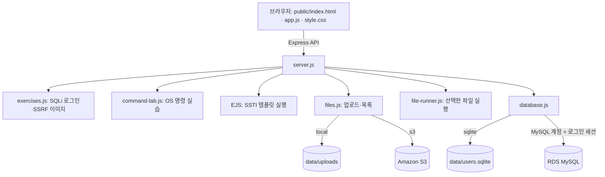

# WHS-Cloud9-Vuln-Web

**WHS-Cloud9-Vuln-Web**은 Node.js + Express로 실행하는 클라우드 보안 실습 웹앱입니다. 로그인 후 파일 업로드, OS 명령, SSTI, 팀 프로필 이미지 기능을 실습할 수 있습니다. 인덱스의 큰 버튼이나 상단 네비게이션을 누르면 각 기능이 모달(현재 화면 위에 뜨는 창)로 열립니다.

이 앱은 SQL Injection, OS 명령 실행, SSTI, SSRF, 업로드 파일 실행을 의도적으로 포함합니다. 실제 개인정보나 운영 AWS 계정으로 실습하지 말고, 실습용 VPC·EC2·RDS·S3와 가짜 계정만 사용하세요.

이 README는 **파일 전체 구조 → 로컬 실행과 AWS 구성 → 기능 사용법** 순서입니다. 먼저 위 구조를 확인하고, 배포 환경에 맞게 구성한 뒤 아래 기능 설명을 따라 해보세요.

## 파일 전체 구조

### 프로젝트 파일 목록

```text
WHS-Cloud9-Vuln-Web/
├── README.md
├── .env.example
├── .env                    # .env.example을 복사해 생성하며 Git에는 포함하지 않음
├── .gitignore
├── package.json
├── package-lock.json
├── server.js
├── secrets.js
├── database.js
├── schema.sql
├── exercises.js
├── image.js
├── command-lab.js
├── files.js
├── file-runner.js
├── public/
│   ├── index.html
│   ├── app.js
│   ├── style.css
│   └── whitehat-school-logo.png
├── data/                 # 로컬 실행 시 생성되며 Git에는 포함되지 않음
│   ├── users.sqlite
│   └── uploads/
└── node_modules/         # npm ci 실행 시 생성되며 Git에는 포함되지 않음
```

`data/`는 `DB_MODE=sqlite` 또는 `STORAGE_MODE=local`로 실행할 때 앱이 만드는 로컬 저장 위치입니다. AWS 모드에서는 계정·세션을 RDS에, 업로드 파일을 S3에 저장합니다. `node_modules/`는 `npm ci`가 의존성(앱이 사용하는 라이브러리)을 설치하면서 만드는 폴더입니다.

### 앱과 저장소의 연결



### 주요 파일의 역할

| 파일 | 역할 |
| --- | --- |
| `server.js` | Express 앱 시작, 로그인, 세션, API 경로 연결 |
| `package.json`, `package-lock.json` | 앱 실행 명령과 설치할 라이브러리 목록·버전 기록 |
| `.env.example` | 로컬 설정을 시작할 때 복사하는 환경변수 예시 |
| `.gitignore` | `.env`, `data/`, `node_modules/`가 Git에 올라가지 않게 제외 |
| `public/index.html` | 로그인 화면, 인덱스, 네비게이션과 모달의 HTML |
| `public/app.js` | 브라우저 동작: 로그인 요청, 버튼·모달, 파일 업로드와 API 호출 |
| `public/style.css` | 화면 디자인과 모바일 크기 조정 |
| `database.js` | SQLite 또는 RDS MySQL 연결 |
| `schema.sql` | RDS에 `users`, `sessions` 테이블을 생성하는 SQL |
| `exercises.js` | SQL Injection 로그인과 SSRF 이미지 요청 실습 |
| `image.js` | 외부에서 가져온 이미지 형식을 확인 |
| `secrets.js` | 설정된 경우 Secrets Manager에서 비밀값을 읽음 |
| `command-lab.js` | OS 명령 실행 실습 |
| `files.js` | 파일 업로드, 사용자별 목록 조회, S3/로컬 저장 |
| `file-runner.js` | 저장된 스크립트를 서버에서 실행하고 결과 반환 |
| `.env` | DB, S3, 포트와 세션 키 등 실행 설정. 직접 만들며 Git에 올리지 않음 |

SQLite 모드에서는 로그인 세션이 메모리에 있어 서버 재시작 시 로그아웃됩니다. MySQL 모드에서는 로그인 세션도 RDS의 `sessions` 테이블에 저장하므로 여러 EC2 인스턴스가 공유할 수 있습니다. 이 앱에서 EC2 웹 서버 계층은 stateless(어느 EC2가 요청을 받아도 같은 공유 DB/S3 상태를 사용)하게 동작합니다.

## 로컬에서 시작하기

Linux EC2 또는 macOS, Node.js **22.13 이상**이 필요합니다. Windows의 명령 실행은 지원하지 않습니다.

```sh
npm ci
cp .env.example .env
npm start
```

http://127.0.0.1:3000 에 접속해 먼저 회원가입하세요. 기본 계정은 없습니다. RDS 연결 전에는 `DB_MODE=sqlite`로 `data/users.sqlite` 파일에 계정을 저장합니다. 재시작해도 계정·프로필·업로드 파일은 남고 로그인 세션만 사라집니다.

## AWS 배포 설정

`.env`에서:

```dotenv
HOST=0.0.0.0
PORT=3000
SECRETS_MANAGER_SECRET_ID=whs-cloud9-vuln-web/prod

DB_MODE=mysql
DB_PORT=3306
DB_SSL_CA=/opt/whs-cloud9/certs/global-bundle.pem

STORAGE_MODE=s3
AWS_REGION=ap-northeast-2
S3_BUCKET=whs-cloud9-vuln-web-lab-896986966760-ap-northeast-2-an
S3_PREFIX=whs-uploads/
```

아직 RDS/S3를 연결하지 않았다면 `DB_MODE=sqlite`, `STORAGE_MODE=local`을 유지하면 됩니다. SQLite 계정은 MySQL로 자동 이동하지 않습니다. RDS로 전환한 후 새 실습 계정을 가입하세요.

### 환경변수 뜻

| 변수 | 의미 | 예시 |
| --- | --- | --- |
| `HOST` | 앱이 요청을 받을 네트워크 주소. EC2에서 외부 ALB/VPN을 통해 들어오는 연결도 받도록 할 때 `0.0.0.0` 사용 | `0.0.0.0` |
| `PORT` | Express 앱의 포트 | `3000` |
| `SECRETS_MANAGER_SECRET_ID` | EC2에서 읽을 Secrets Manager 비밀 이름 또는 ARN. 설정하면 DB 접속값과 세션 키를 이곳에서 읽음 | `whs-cloud9-vuln-web/prod` |
| `SESSION_SECRET` | 로컬 실행 때 쓰는 로그인 쿠키 서명 키. EC2는 Secrets Manager에 저장 | 무작위 문자열 |
| `DB_MODE` | 계정 정보를 저장할 DB 선택 | `sqlite` 또는 `mysql` |
| `DB_HOST`, `DB_PORT` | RDS 접속 주소와 포트 | RDS endpoint, `3306` |
| `DB_NAME` | 사용할 DB 이름 | `whs_cloud9` |
| `DB_USER`, `DB_PASSWORD` | 로컬 실행 때 쓰는 앱 전용 MySQL 계정 값. EC2에서는 Secrets Manager에 저장 | `whs_app`, 앱 계정 비밀번호 |
| `DB_SSL_CA` | RDS 서버 인증서 묶음 파일의 EC2 내 경로 | `/opt/whs-cloud9/certs/global-bundle.pem` |
| `STORAGE_MODE` | 업로드 파일 저장 위치 | `local` 또는 `s3` |
| `AWS_REGION`, `S3_BUCKET` | S3 모드에서 사용할 리전과 버킷 | `ap-northeast-2`, 버킷 이름 |
| `S3_PREFIX` | 버킷 안의 앱 파일 경로 | `whs-uploads/` |

`.env.example`을 복사해 `.env`를 만들고 실제 값만 채웁니다. `.env`는 비밀번호와 세션 키가 있어 외부에 공유하거나 Git에 올리면 안 됩니다.

### RDS MySQL 설정

이 앱은 사용자 계정과 로그인 세션을 RDS MySQL에 저장합니다. RDS 인스턴스는 EC2와 같은 리전에 만들고, 인터넷에서 직접 접근하지 못하도록 설정하세요. RDS 콘솔 화면 이름은 AWS가 바꿀 수 있으므로 [RDS DB 인스턴스 생성 공식 안내](https://docs.aws.amazon.com/AmazonRDS/latest/UserGuide/USER_CreateDBInstance.html)도 함께 참고하세요.

#### 1. RDS 만들기

1. AWS 콘솔에서 **RDS → Databases → Create database**를 엽니다.
2. 엔진은 **MySQL**을 고릅니다. EC2와 같은 리전(현재 설정 예시는 서울 `ap-northeast-2`)을 선택합니다.
3. 실습용이면 템플릿은 **Dev/Test**를 고르고, DB 식별자는 예를 들어 `whs-cloud9-mysql`로 정합니다.
4. 마스터 사용자 이름과 비밀번호를 만듭니다. 마스터 비밀번호는 앱 `.env`에 넣지 않습니다.
5. **Connectivity**에서 EC2와 같은 VPC의 private DB subnet group을 선택합니다. 목록에 적절한 그룹이 없다면 RDS의 **Subnet groups → Create DB subnet group**에서 같은 VPC의 private subnet을 서로 다른 가용 영역(AZ) 두 곳 이상 골라 만듭니다. **Public access**는 `No`로 둡니다.
6. RDS 보안 그룹의 인바운드 규칙에는 MySQL/Aurora TCP `3306`, 소스에는 웹앱 EC2의 **보안 그룹 ID**를 지정합니다. EC2 보안 그룹의 아웃바운드가 제한되어 있다면 EC2에서 RDS 보안 그룹으로 나가는 TCP `3306`도 허용합니다. `0.0.0.0/0`은 사용하지 마세요. 보안 그룹은 방화벽 규칙입니다.
7. 백업 보존 기간, 스토리지, 모니터링은 실습 비용과 복구 필요에 맞게 선택하고 DB를 생성합니다. RDS는 실행 시간 외에도 저장 공간과 백업 비용이 발생할 수 있습니다.
8. 상태가 `Available`이 되면 DB 상세의 **Connectivity & security**에서 endpoint(접속 주소)와 port를 확인합니다. MySQL 기본 포트는 `3306`입니다. [엔드포인트 확인 안내](https://docs.aws.amazon.com/AmazonRDS/latest/UserGuide/CHAP_CommonTasks.Connect.EndpointAndPort.html)

#### 2. DB와 테이블 만들기

RDS에 접속할 수 있는 관리 PC 또는 EC2에서 MySQL 클라이언트를 사용합니다. RDS가 private이면 인터넷의 내 PC에서 바로 접속할 수 없습니다. 같은 VPC의 EC2 또는 승인된 관리 경로를 사용하세요. RDS CA 인증서 묶음은 [AWS 공식 안내](https://docs.aws.amazon.com/AmazonRDS/latest/UserGuide/UsingWithRDS.SSL.html)에서 받습니다.

EC2에서 `mysql --version`으로 MySQL 명령줄 클라이언트가 있는지 확인합니다. 없으면 EC2 운영체제의 공식 패키지 저장소에서 MySQL 클라이언트를 설치합니다. RDS CA 인증서 파일은 아래의 공식 다운로드 주소에서 받아 문서의 경로에 둡니다. EC2에 인터넷 경로가 없다면 인터넷이 되는 관리 PC에서 받은 파일을 승인된 배포 경로로 EC2에 복사합니다.

```sh
sudo mkdir -p /opt/whs-cloud9/certs
sudo curl -o /opt/whs-cloud9/certs/global-bundle.pem https://truststore.pki.rds.amazonaws.com/global/global-bundle.pem
```

프로젝트의 `schema.sql`은 `whs_cloud9` DB와 두 테이블을 만듭니다. EC2에서 다음처럼 실행할 수 있습니다.

```sh
mysql --host=RDS_ENDPOINT --port=3306 --user=MASTER_USER --password \
  --ssl-mode=VERIFY_IDENTITY --ssl-ca=/opt/whs-cloud9/certs/global-bundle.pem \
  < schema.sql
```

`RDS_ENDPOINT`와 `MASTER_USER`를 실제 값으로 바꾸세요. 명령이 비밀번호를 물으면 입력합니다. `schema.sql`은 `users`(계정/프로필)와 `sessions`(로그인 상태) 테이블을 생성합니다. 앱이 테이블을 자동으로 만들지는 않습니다.

#### 3. 앱 전용 DB 계정 만들기

마스터 계정 대신 앱 전용 계정을 사용합니다. MySQL 관리 도구에서 마스터 계정으로 다음 SQL을 실행하고 비밀번호를 바꾸세요.

```sql
CREATE USER 'whs_app'@'%' IDENTIFIED BY '여기에-긴-임의-비밀번호';
GRANT SELECT, INSERT, UPDATE ON whs_cloud9.users TO 'whs_app'@'%';
GRANT SELECT, INSERT, UPDATE, DELETE ON whs_cloud9.sessions TO 'whs_app'@'%';
```

`%`는 MySQL 계정의 접속 호스트 부분입니다. 네트워크 접근은 RDS 보안 그룹이 EC2로 제한합니다. 앱 계정에는 DB/테이블 생성 권한을 주지 않습니다.

#### 4. EC2에서 앱 설정

Secrets Manager를 쓰지 않는 로컬/수동 설정에서는 프로젝트 `.env`에 RDS endpoint, DB 이름과 앱 계정을 설정합니다. AWS 배포에서는 아래의 Secrets Manager 연결 절차에서 민감값을 저장합니다. `DB_SSL_CA`는 인증서 파일의 실제 경로여야 합니다.

```dotenv
DB_MODE=mysql
DB_HOST=RDS_ENDPOINT
DB_PORT=3306
DB_NAME=whs_cloud9
DB_USER=whs_app
DB_SSL_CA=/opt/whs-cloud9/certs/global-bundle.pem
```

수동 설정 시 `SESSION_SECRET`도 `.env`에 설정합니다. AWS 배포에서는 이 값도 Secrets Manager JSON에 보관합니다. 무작위 값을 만들 때는 다음 명령을 쓰세요.

```sh
node -e "console.log(require('crypto').randomBytes(32).toString('hex'))"
```

여러 EC2를 사용할 때는 **모든 EC2가 같은 Secrets Manager 비밀을 읽도록** 해야 로그인 쿠키를 서로 확인할 수 있습니다. 아직 RDS를 연결하지 않았다면 `DB_MODE=sqlite`를 유지하세요. 서버를 `npm start`로 재시작하면 MySQL 모드에서 사용자 데이터와 세션이 RDS를 사용합니다. 기존 SQLite 사용자는 자동 복사되지 않으므로 RDS 전환 후 새로 가입해야 합니다.

#### 5. 연결 확인

1. 앱이 실행되고 브라우저의 `/api/health`에서 `database: "mysql"`을 확인합니다. 이는 모드 확인이며 DB 연결 자체를 보증하지는 않습니다.
2. 회원가입과 로그인을 해보고, RDS의 `users` 테이블에 계정이 생겼는지 확인합니다.
3. `sessions` 테이블에 세션 행이 생기는지 확인합니다.
4. 로그인 상태에서 앱을 재시작한 뒤 페이지를 새로고침합니다. 로그인 상태가 유지되면 세션이 RDS에 저장된 것입니다.
5. 여러 EC2로 확장한 경우 각 인스턴스가 같은 RDS와 Secrets Manager 비밀을 사용해야 합니다. 로드 밸런서(ALB)에서 요청이 다른 인스턴스로 가도 로그인 상태가 유지되는지 확인합니다.

로그아웃하거나 만료된 세션은 바로 사용 불가가 되지만, 만료된 행은 테이블에 남을 수 있습니다. 필요하면 관리자가 다음 SQL로 만료 행을 지울 수 있습니다.

```sql
DELETE FROM whs_cloud9.sessions WHERE expires <= UNIX_TIMESTAMP(CURRENT_TIMESTAMP(3)) * 1000;
```

이 앱의 RDS 연결은 [TLS 인증서로 서버를 확인하며 암호화](https://docs.aws.amazon.com/AmazonRDS/latest/UserGuide/mysql-ssl-connections.html)합니다. 접속이 안 되면 endpoint/비밀번호, EC2와 RDS의 VPC·보안 그룹, CA 파일 경로를 차례로 확인하세요.

연결 코드는 `database.js`, 의도적으로 취약한 로그인 쿼리는 `exercises.js`입니다. MySQL 연결은 TLS(암호화 연결)를 검증합니다. 실습용 로그인 비밀번호는 SHA-256으로 저장합니다. 이는 운영용 비밀번호 저장 방식이 아닙니다. 이전 버전의 scrypt 계정은 이 버전과 호환되지 않으므로 별도의 실습 DB/계정을 사용하세요.

### AWS Secrets Manager 연결

EC2에서는 RDS 비밀번호와 `SESSION_SECRET`을 `.env`에 적지 않고 Secrets Manager에서 가져옵니다. 앱 시작 시 한 번 읽으므로, 비밀값을 읽지 못하면 잘못된 기본값으로 실행하지 않고 시작을 멈춥니다. 앱은 EC2 인스턴스 프로파일(IAM 역할)의 임시 자격 증명을 AWS SDK에서 자동으로 사용합니다. AWS 액세스 키를 코드나 `.env`에 넣지 마세요. [AWS SDK for JavaScript v3 공식 예제](https://docs.aws.amazon.com/sdk-for-javascript/v3/developer-guide/javascript_secrets-manager_code_examples.html)

#### 1. 비밀값 만들기

AWS 콘솔에서 **Secrets Manager → Store a new secret → Other type of secret**을 고르고, 아래 키 이름 그대로 JSON을 저장합니다. 예를 들어 이름은 `whs-cloud9-vuln-web/prod`로 정할 수 있습니다.

```json
{
  "SESSION_SECRET": "길고-무작위인-세션-서명-값",
  "DB_HOST": "RDS의 실제 엔드포인트",
  "DB_NAME": "whs_cloud9",
  "DB_USER": "whs_app",
  "DB_PASSWORD": "앱-DB-비밀번호"
}
```

`DB_PORT`, `DB_SSL_CA`, S3 버킷과 리전처럼 비밀이 아닌 설정은 EC2 `.env`에 둡니다. RDS CA 인증서 파일은 EC2에 따로 배포해야 합니다.

#### 2. EC2가 비밀값을 읽도록 설정

EC2에 연결된 IAM 역할에 `secretsmanager:GetSecretValue`를 추가하고, 리소스 범위는 방금 만든 비밀의 ARN 하나로 제한합니다. 기본 AWS 관리 키가 아닌 고객 관리형 KMS 키로 암호화했다면 해당 키에 대한 `kms:Decrypt` 권한도 필요합니다. 역할은 EC2가 AWS API를 부를 때 임시 자격 증명을 주는 기능입니다. [Secrets Manager 권한 공식 안내](https://docs.aws.amazon.com/secretsmanager/latest/userguide/auth-and-access_iam-policies.html)

EC2가 private subnet에 있고 NAT 인터넷 경로가 없다면 VPC에 Secrets Manager 인터페이스 엔드포인트(`com.amazonaws.ap-northeast-2.secretsmanager`)를 연결해야 합니다. 엔드포인트 보안 그룹은 EC2 보안 그룹에서 오는 HTTPS(443)를 허용해야 합니다. private subnet에 둔 앱도 비밀 저장소까지 네트워크로 연결되어야 값을 가져올 수 있습니다.

#### 3. EC2 환경 설정 및 실행

EC2의 `.env`에는 다음처럼 연결 모드와 비밀 이름만 적고, `DB_PASSWORD`나 `SESSION_SECRET`은 적지 않습니다.

```dotenv
HOST=0.0.0.0
PORT=3000
SECRETS_MANAGER_SECRET_ID=whs-cloud9-vuln-web/prod
DB_MODE=mysql
DB_PORT=3306
DB_SSL_CA=/opt/whs-cloud9/certs/global-bundle.pem
STORAGE_MODE=s3
AWS_REGION=ap-northeast-2
S3_BUCKET=여기에-S3-버킷-이름
S3_PREFIX=whs-uploads/
```

필요한 IAM 권한이 부여된 역할을 EC2에 연결한 뒤 `npm install`과 `npm start`를 실행합니다. Secrets Manager 비밀을 수정하거나 교체해도 실행 중인 프로세스는 시작 때 읽은 값을 계속 사용하므로 앱 프로세스를 재시작해야 새 값을 사용합니다. AWS가 관리하는 기본 Secrets Manager 암호화 키를 사용할 때는 서비스가 복호화를 처리하며, 고객 관리형 키 사용 시 `kms:Decrypt` 권한을 별도로 확인합니다. [Secrets Manager 암호화 공식 안내](https://docs.aws.amazon.com/secretsmanager/latest/userguide/security-encryption.html)

### S3 업로드

업로드·목록·파일 읽기 코드는 `files.js`, 실행 코드는 `file-runner.js`입니다. EC2 IAM 역할을 사용하며 AWS 키를 코드에 넣지 않습니다. EC2에 S3 권한이 이미 있다면 `.env`에서 `STORAGE_MODE=s3`로 바꾸세요. 로컬 개발은 `STORAGE_MODE=local` 그대로 실행할 수 있습니다.

S3는 실제 폴더를 만들지 않고 파일 이름 앞에 경로를 붙여 폴더처럼 보이게 합니다. 앱은 `whs-uploads/<사용자 UUID>/<무작위 UUID>--<인코딩된 원본 파일명>` 형식으로 저장합니다. 예: `whs-uploads/7c7087fe-378a-469a-a2bb-de95e08349b3/3e...--hello.js`. 사전에 디렉터리나 객체를 만들 필요가 없습니다. 이 경로 구성이면 사용자별 목록 조회도 분리됩니다.

S3 퍼블릭 액세스 차단을 유지하세요. 서버가 업로드하므로 버킷 CORS 설정은 필요하지 않습니다. 고객 관리형 KMS 키를 쓰는 버킷은 해당 키 권한도 필요합니다. S3 오류 시 로컬 저장으로 바꾸거나 성공으로 표시하지 않습니다. 업로드 직후에는 저장만 합니다. 목록에서 실행 버튼을 눌렀을 때 서버가 파일을 가져와 실행합니다. 파일을 공개 URL로 제공하지 않습니다. 버킷의 고객 관리형 KMS 키로 암호화된 파일을 읽으려면 kms:Decrypt 권한도 필요합니다.

## Private Subnet에서의 연결

Private Subnet은 인터넷에서 EC2로 직접 들어오는 경로를 제한하는 네트워크입니다. **앱 자체의 OS 명령 실행이나 내부 주소 요청을 막는 기능은 아닙니다.** OS 명령은 앱 계정의 파일/환경변수에 접근할 수 있고, SSRF는 EC2의 네트워크 접근 범위를 따릅니다.

- 접속: 실습용 VPN/내부 ALB 등 현재 구성한 접근 경로를 사용하세요. EC2의 3000번 포트는 해당 실습 출발지에만 허용합니다.
- 외부 이미지: 인터넷으로 나가는 경로(NAT Gateway 등)가 있어야 외부 HTTP/HTTPS 이미지를 가져올 수 있습니다. 경로가 없다면 승인된 내부 테스트 URL을 사용하세요. [AWS NAT 설명](https://docs.aws.amazon.com/vpc/latest/userguide/vpc-nat-gateway.html)
- S3: S3 Gateway Endpoint 또는 기존 외부 연결 경로가 필요합니다. [AWS 라우팅 설명](https://docs.aws.amazon.com/vpc/latest/userguide/route-table-options.html)
- 설치: `npm ci`에도 패키지 저장소 접근 경로가 필요합니다. 외부 연결이 없다면 동일 OS/CPU 환경에서 준비한 배포 패키지를 반입하세요.
- HTTPS ALB를 사용한다면 해당 ALB를 통해 접속하세요.

## 배포 후 확인

EC2에서 앱을 시작한 뒤 브라우저에서 가입·로그인, 파일 업로드·목록·실행을 차례로 확인하세요. `/api/health`는 앱의 설정 모드만 보여주며 RDS나 S3의 실제 연결 성공을 증명하지 않습니다.

### 자주 만나는 문제

| 증상 | 먼저 확인할 것 |
| --- | --- |
| `DB_HOST` 또는 `DB_SSL_CA 설정이 필요합니다` | `.env`가 앱 폴더에 있는지, `DB_MODE=mysql`일 때 필요한 값이 채워졌는지 확인 |
| `ETIMEDOUT`, 연결 시간 초과 | RDS가 `Available`인지, EC2와 RDS가 연결된 VPC인지, RDS 보안 그룹 3306 출발지가 EC2 보안 그룹인지 확인 |
| 인증서 오류 | `DB_SSL_CA` 파일 경로와 PEM 인증서 파일을 확인 |
| `Access denied for user` | 앱 DB 사용자·비밀번호 및 `whs_cloud9.users`, `whs_cloud9.sessions` 권한 확인 |
| `Table ... doesn't exist` | 관리자 계정으로 `schema.sql`을 실행했는지 확인 |
| S3 `AccessDenied` | EC2 IAM 역할과 `STORAGE_MODE=s3`, 버킷 이름·리전을 확인 |
| 업로드 파일 목록이 비어 있음 | 현재 로그인 계정의 파일만 보이는지, S3 모드와 버킷 prefix가 맞는지 확인 |
| 서버 재시작 후 로그아웃됨 | `DB_MODE=mysql`인지 확인. SQLite 모드는 세션이 메모리에만 저장됨 |

## AWS Well-Architected 관점의 적용 범위

이 앱은 요청한 취약점 실습 기능을 의도적으로 포함합니다. 전용 실습 EC2, 전용 버킷/DB, 가짜 데이터를 사용하고 IAM·보안 그룹 권한과 접속 대상을 좁혀 영향 범위를 제한하세요. 실습 EC2 역할에는 운영 데이터 권한을 연결하지 마세요.

- 보안: 일반 OS 계정으로 실행하고, 필요한 실습 자원만 접근하게 합니다.
- 안정성: 파일/이미지 5MB, OS 실행 8초·출력 32KB·동시 1건을 제한합니다. 이 제한은 보안 격리를 보장하지 않습니다.
- 운영: `.env`는 Git에 포함하지 않습니다. `DB_MODE=mysql`이면 RDS 세션 저장소를 사용하고, `DB_MODE=sqlite`이면 세션이 메모리에 저장됩니다. RDS/S3에 접속할 수 있도록 EC2 네트워크 경로를 준비하세요.
- 비용: S3/RDS/EC2/NAT 비용은 사용자의 구성에 따라 발생합니다. 실습 종료 후 자료 보관 기간과 리소스 정리를 관리하세요.

## 화면 사용

1. 첫 화면에서 이메일과 비밀번호로 가입한 다음 로그인합니다.
2. 상단 네비게이션이나 첫 화면의 큰 버튼을 눌러 `파일 업로드`, `OS 명령`, `SSTI 실습`, `팀 프로필` 모달을 엽니다.
3. 파일 모달에서 파일을 올리면 설정에 따라 S3 또는 로컬 폴더에 저장됩니다. 지원되는 `.js`, `.mjs`, `.cjs`, `.py`, `.sh` 파일은 목록에서 **실행**할 수 있습니다.
4. OS 명령 모달은 입력한 명령을 서버에서 실행합니다. 팀 프로필은 서버가 입력한 URL에 요청해 이미지 정보를 가져옵니다.
5. 오른쪽 위 로그아웃 버튼으로 세션을 종료합니다.

각 기능은 취약점 실습용입니다. 업로드한 코드, OS 명령, SSTI 템플릿은 EC2의 앱 사용자 권한으로 실행됩니다. 테스트할 때는 출력 문구 확인처럼 영향이 작은 입력을 사용하세요.

| API | 기능 |
| --- | --- |
| `POST /api/register` | 사용자 가입 |
| `POST /api/login`, `POST /api/logout`, `GET /api/me` | 로그인, 로그아웃, 현재 사용자 확인 |
| `POST /api/files`, `GET /api/files` | 파일 업로드와 현재 사용자 파일 목록 |
| `POST /api/files/execute` | S3 또는 로컬에 저장된 지원 스크립트 실행 |
| `POST /api/labs/os-command` | OS 명령 실습 |
| `POST /api/labs/ssti` | EJS 템플릿 해석 실습 |
| `POST /api/images/preview` | 서버가 URL에 요청해 이미지 미리보기 |
| `POST /api/profile/image` | 미리 본 이미지를 계정 프로필로 저장 |

## 파일 업로드, 목록 보기, 실행

이 기능은 **파일을 서버에 저장하는 단계**와 **저장한 파일을 서버에서 실행하는 단계**로 나뉩니다. 업로드만 했을 때는 파일이 실행되지 않습니다. 목록의 **실행** 버튼을 눌렀을 때 서버가 다시 파일을 읽어 실행합니다.

### 직접 따라 해보기

1. 로그인하고 대시보드나 상단 메뉴에서 **파일 업로드**를 엽니다.
2. 컴퓨터에서 실행해 볼 파일을 선택합니다. 처음 확인할 때는 아래처럼 결과 문구만 출력하는 파일을 `hello.js`라는 이름으로 저장하세요.

   ```js
   console.log('Cloud9 file execution worked');
   ```

3. **파일 업로드**를 누릅니다. 성공하면 파일이 저장되고 **저장된 파일** 목록에 나타납니다. 이 단계에서는 아직 코드가 실행되지 않았습니다.
4. `hello.js` 옆의 **실행**을 누릅니다. 결과 상자에 `Cloud9 file execution worked`와 종료 코드 `0`이 표시되면 실행이 끝난 것입니다.
5. 다른 사용자의 계정으로 로그인하면 그 사용자의 파일 목록을 봅니다. 같은 계정으로 다시 로그인하면 저장 위치가 공유 모드인지에 따라 이전 파일을 다시 볼 수 있습니다.

실행 가능한 확장자와 사용되는 프로그램은 다음과 같습니다.

| 파일 끝 이름 | 실행 프로그램 | 예시 |
| --- | --- | --- |
| `.js`, `.mjs`, `.cjs` | 앱을 실행하는 Node.js | `hello.js` |
| `.py` | EC2의 `python3` | `hello.py` |
| `.sh` | Linux/macOS의 `/bin/sh` | `hello.sh` |

다른 형식의 파일도 업로드해 보관할 수 있지만 **실행** 버튼은 비활성화됩니다. 업로드 크기는 파일당 최대 5MB입니다. 파일 이름은 화면에 표시하고 실행 형식을 판단하는 데 사용되며, 저장할 때 원래 파일 이름만 믿지 않도록 무작위 식별자도 붙입니다.

이전 버전에서 올린 파일 중 목록 이름이 UUID처럼 보이고 **실행 불가**로 나오는 것이 있을 수 있습니다. 예전 파일 키에는 원래 파일 이름과 확장자가 없어서 서버가 어떤 프로그램으로 실행해야 할지 알 수 없습니다. 해당 파일을 다시 업로드하면 새 형식으로 저장되어 실행할 수 있습니다.

### 파일이 저장되는 위치

`.env`의 `STORAGE_MODE` 값으로 저장 위치를 고릅니다.

| 설정 | 저장 위치 | 서버 재시작·다른 EC2에서 보이는가 |
| --- | --- | --- |
| `STORAGE_MODE=local` | 앱 폴더의 `data/uploads/<사용자 UUID>/` | 같은 디스크에서는 남지만, 디스크가 다른 EC2와 공유되지 않습니다. |
| `STORAGE_MODE=s3` | S3 버킷의 `<S3_PREFIX>/<사용자 UUID>/` 경로 | 같은 버킷·prefix를 쓰는 EC2끼리 파일을 공유합니다. |

S3에는 실제 폴더 대신 객체 키(파일의 전체 경로 이름)가 저장됩니다. 예를 들어 `whs-uploads/사용자 UUID/무작위 ID--hello.js` 같은 이름입니다. S3 콘솔에서는 이 키를 폴더처럼 나눠 보여줍니다. `S3_PREFIX`의 기본값은 `whs-uploads/`입니다.

앱은 로그인 세션에서 현재 사용자 UUID를 확인한 뒤 그 UUID 경로의 파일만 목록에 보여줍니다. 실행 요청에 파일 키를 넣더라도 서버가 현재 사용자의 경로인지 다시 확인합니다. 따라서 다른 사용자의 UUID 경로에 있는 파일을 임의로 지정해 실행할 수 없습니다. S3 모드에서는 EC2 역할에 앱 prefix 범위의 업로드(`PutObject`), 목록 확인(`ListBucket`), 실행할 파일 읽기(`GetObject`) 권한이 필요합니다. 앱은 파일을 공개 URL로 만들지 않으며, 버킷의 퍼블릭 액세스 차단을 유지하세요.

### 실행할 때 서버에서 일어나는 일

```text
브라우저의 실행 버튼
  → POST /api/files/execute로 파일 key 전송
  → 서버가 로그인한 사용자와 key 소유 경로 확인
  → S3 또는 로컬 저장소에서 파일 읽기
  → OS 임시 폴더에 복사
  → 확장자에 맞는 프로그램으로 실행
  → 출력과 종료 코드를 브라우저에 표시
  → 임시 파일과 프로세스 정리
```

실행 결과에서 `종료 코드 0`은 정상 종료를 뜻합니다. 0이 아닌 값은 프로그램이 오류를 내거나 실패했다는 뜻이며, 표준 출력과 오류 출력은 따로 표시됩니다. 실행 결과와 실행 이력은 DB나 S3에 저장하지 않습니다.

Python 파일은 EC2에 `python3`가 설치되어 있어야 실행됩니다. 각 파일은 다른 업로드 파일과 함께 실행되는 것이 아니라 하나의 독립 스크립트로 실행됩니다. 파일은 임시 폴더에 복사되어 실행 후 삭제됩니다. **임시 폴더를 쓴다는 뜻은 별도 보안 상자에서 실행한다는 뜻이 아닙니다.** 스크립트는 웹앱과 같은 OS 사용자 권한을 가지며, 파일을 만들거나 별도 프로세스를 남길 수 있습니다. 이 코드가 AWS SDK 또는 메타데이터에 접근할 수 있는지는 EC2의 IAM 역할과 네트워크 설정에 달려 있습니다.

현재 실행 제한은 파일 5MB 이하, 최대 8초, 출력 32KB, Node.js 서버 프로세스당 한 번에 한 파일입니다. 제한 시간이 지나거나 출력이 너무 크면 오류로 처리합니다. 이 제한은 악성 코드 실행을 안전하게 격리해 주지 않습니다. 승인된 실습 EC2에서 가짜 데이터로만 사용하세요.

### 개발자용 API

- `POST /api/files`: 업로드한 파일을 저장합니다. 브라우저 화면은 `multipart/form-data`로 파일을 보냅니다.
- `GET /api/files`: 현재 로그인 사용자의 파일 목록을 100개씩 반환합니다. 다음 페이지가 있으면 `nextCursor`가 함께 옵니다.
- `POST /api/files/execute`: `{ "key": "목록에 표시된 파일의 key" }`를 받아 해당 파일을 실행합니다.

세 API 모두 로그인 세션이 필요합니다. `POST` 요청에는 `X-WHS-Request: 1` 헤더도 필요하며, 화면에서 사용하면 브라우저 코드가 자동으로 붙입니다. 다른 앱에서 직접 호출한다면 로그인 쿠키와 이 헤더를 함께 보내야 합니다.

**Stateless 배포에서 중요한 점:** 파일 자체는 S3에, 계정과 로그인 세션은 RDS에 두면 여러 EC2가 같은 상태를 사용할 수 있습니다. `local` 저장은 EC2 디스크에 남으므로 이 방식에 해당하지 않습니다. S3·RDS 연결 여부는 `/api/health`의 모드 표시만으로 확인되지 않으니 실제 업로드, 목록, 실행, 재로그인 동작을 각각 확인해야 합니다.

## SSTI 실습

SSTI(Server-Side Template Injection, 서버 측 템플릿 삽입)는 사용자가 입력한 **글**을 서버가 **실행할 코드**로 해석하는 취약점입니다. 이 앱의 템플릿 도구는 EJS(HTML 등에 JavaScript 결과를 넣는 도구)입니다. [EJS 공식 설명](https://ejs.co/)의 표현처럼 EJS는 JavaScript를 실행합니다. 현재 [`server.js`](server.js)의 `/api/labs/ssti`는 사용자가 입력한 문자열 전체를 `ejs.render()`에 넘깁니다. 따라서 출력 문구만 바꾸는 것을 넘어 서버의 JavaScript 실행 권한을 사용할 수 있습니다.

로컬 또는 **승인된 실습 EC2**에서 로그인한 뒤 상단 메뉴나 대시보드의 **SSTI 실습** 버튼을 누릅니다. 입력창에 아래 내용을 하나씩 넣고 **결과 보기**를 누르세요.

1. `<%= 7 * 7 %>` → `49`가 나오면 입력이 템플릿 코드로 해석된 것입니다.
2. `<%= process.version %>` → 서버의 Node.js 버전이 나오면 브라우저가 아니라 **서버의 JavaScript 실행 환경**에 접근한 것입니다.
3. `<%= process.getBuiltinModule('child_process').execFileSync('whoami').toString().trim() %>` → 웹앱을 실행한 OS 계정 이름이 나오면 RCE(원격 코드 실행: 웹 요청으로 서버에서 코드를 실행함)를 확인한 것입니다. `whoami`는 현재 사용자 이름만 출력하며 파일이나 AWS 자원을 바꾸지 않습니다.

이 실습은 **로그인한 사용자만** 호출할 수 있습니다. 템플릿 입력은 최대 2048자이지만, 길이 제한은 실행 권한을 제한하지 않습니다. 실습 EC2에 S3 또는 Secrets Manager 권한을 가진 IAM 역할(EC2가 AWS에 접근할 때 쓰는 권한)이 연결되어 있다면, 코드 실행자는 그 역할이 허용한 범위까지 접근할 수 있습니다. 실제 접근 범위는 배포 시 부여한 권한과 네트워크 설정을 따르며, 위 세 단계만으로 AWS 자원 접근을 검증한 것은 아닙니다. 실습에는 전용 EC2·가짜 데이터·최소 권한의 역할을 사용하세요. [OWASP SSTI 설명](https://wstg.owasp.org/latest/4-Web_Application_Security_Testing/07-Injection/18-Server-side_Template_Injection/)

같은 기능을 API로 직접 호출하려면 `POST /api/labs/ssti`에 `{ "template": "<%= 7 * 7 %>" }`를 보냅니다. 브라우저 개발자 도구의 콘솔에서는 로그인 상태에서 아래 예시를 실행할 수 있습니다.

```js
fetch('/api/labs/ssti', {
  method: 'POST',
  headers: { 'Content-Type': 'application/json', 'X-WHS-Request': '1' },
  body: JSON.stringify({ template: '<%= 7 * 7 %>' })
}).then(response => response.json()).then(console.log);
```

템플릿에는 로그인한 사용자의 `name`도 전달됩니다. 위 예시는 무해한 확인용이며, 실습 서버의 파일·비밀값을 실제로 열거나 외부로 전송하는 명령은 포함하지 않습니다.
